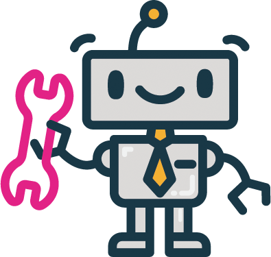

# PWD - PHP Trabajo Práctico Librerias Útiles

## Tabla de contenido

- [Descripción](#descripción-)
  - [Objetivo](#objetivo-)
  - [Pautas](#pautas-)
- [Procedimiento](#procedimiento-)
  - [Requisitos](#requisitos-)
  - [Paso 1](#paso-1)
  - [Paso 2](#paso-2)
  - [Paso 3](#paso-3)
  - [Paso 4](#paso-4)
- [Recursos útiles](#recursos-útiles-)

## Descripción 📋

- <b>Nombre del grupo:</b> Grupo 1
- <b>Integrantes:</b> [Eugenia Garcia Ruiz](https://github.com/Eugenia-2793) y [Marcos Andrés Travaglini](https://github.com/Blackpachamame)
- <b>Carrera:</b> Tecnicatura Universitaria en Desarrollo Web
- <b>Materia:</b> Programación Web Dinámica

### Objetivo 📌

Deberá investigar y probar el uso (con ejemplos) de alguna librería en PHP, que resuelva un problema específico.

### Pautas 📜

- El trabajo se presentará en grupos con un máximo de 2 integrantes.
- Deberá anunciar la librería elegida y los integrantes del grupo respondiendo al foro creado para tal fin. Las clases no se pueden repetir.
- Se debe exponer y explicar la implementación del uso de la clase seleccionada.
- Se entregarán las fuentes, una descripción de la clase y todo el material que puedan reunir.

## Procedimiento 👣

<p align="center"></p>
<h1 align="center">BotMan</h1>
La librería php que elegimos es BotMan, es el chatbot más popular del mundo.
BotMan es una librería de PHP que está diseñada para simplificar la tarea de desarrollar bots innovadores para múltiples plataformas de mensajería, incluyendo Slack, Telegram, Microsoft Bot Framework, Nexmo, HipChat, Facebook Messenger, WeChat y muchas más.

### Requisitos 📚

- PHP >= 7.1.3
- Composer

### Paso 1

**Instalar BotMan**

En nuestro caso, para realizar este tp no vamos a usar BotMan Studio, por lo que vamos a requerir de instalar [Composer](https://getcomposer.org/) en primer lugar.

Luego, vamos a la [documentación de instalación](https://botman.io/2.0/installation) y abajo donde dice Installing BotMan nos figura el siguiente comando que pondremos en la terminal: `composer require botman/botman`

Esto nos va a generar una carpeta vendor, un archivo json y un archivo lock.

Para completar este paso, creamos un archivo php que va a ser nuestro controlador y pegamos el siguiente código:

```php
<?php
use  BotMan\BotMan\BotMan;
use  BotMan\BotMan\BotManFactory;
use  BotMan\BotMan\Drivers\DriverManager;

$config  =  [
// Your driver-specific configuration
// "telegram" => [
// "token" => "TOKEN"
// ]
];

// Load the driver(s) you want to use
DriverManager::loadDriver(\BotMan\Drivers\Telegram\TelegramDriver::class);

// Create an instance
$botman  =  BotManFactory::create($config);

// Give the bot something to listen for.
$botman->hears('hello', function  (BotMan $bot)  {
	$bot->reply('Hello yourself.');
});

// Start listening
$botman->listen();
```

### Paso 2

**Instalar Drive-Web**

Seguimos la [documentación sobre driver-web](https://botman.io/2.0/driver-web).
Simplemente ponemos este comando en la terminal: `composer require botman/driver-web` Esto nos crea una nueva carpeta driver-web dentro de la carpeta botman y modifica el json agregando la versión de driver-web (dato irrelevante).

Por último, modificamos nuestro controlador y ponemos lo siguiente:

```php
DriverManager::loadDriver(\BotMan\Drivers\Web\WebDriver::class);
// Create BotMan instance
BotManFactory::create($config);
```

### Paso 3

**Usamos Symfony Cache**

Podemos encontrar información al final de esta [documentación sobre caché](https://botman.io/2.0/cache-drivers).

De ahí vamos a [Symfony Cache](https://symfony.com/doc/current/components/cache.html) donde encontramos el siguiente comando: `composer require symfony/cache` Lo aplicamos y nos crea nuevas clases, luego volvemos a editar nuestro controlador con lo siguiente:

```php
use BotMan\BotMan\Cache\SymfonyCache;
use Symfony\Component\Cache\Adapter\FilesystemAdapter;
$adapter = new FilesystemAdapter();
$botman = BotManFactory::create($config, new SymfonyCache($adapter));
```

Finalmente nuestro controlador debería verse de la siguiente manera:

```php
<?php require_once 'vendor/autoload.php';
use BotMan\BotMan\Cache\SymfonyCache;
use Symfony\Component\Cache\Adapter\FilesystemAdapter;
use BotMan\BotMan\BotManFactory;
use BotMan\BotMan\Drivers\DriverManager;

$config = [];

DriverManager::loadDriver(\BotMan\Drivers\Web\WebDriver::class);

$adapter = new FilesystemAdapter();
$botman = BotManFactory::create($config, new SymfonyCache($adapter));

$botman->hears('Hola', function ($bot) {
	$bot->reply('Mundo');
});

$botman->fallback(function ($bot) {
	$bot->reply('Sorry, I did not understand these commands. Here is a list of commands I understand: ...');
});

// Start listening
$botman->listen();
```

### Paso 4

**Integrar BotMan a nuestro index usando Web Widget**

Seguimos la [documentación sobre web-widget](https://botman.io/2.0/web-widget).
Creamos un nuevo archivo _(ej: chat.html)_ y ponemos el siguiente enlace en el head: `<link rel="stylesheet" type="text/css" href="https://cdn.jsdelivr.net/npm/botman-web-widget@0/build/assets/css/chat.min.css">` y este script: `<script id="botmanWidget" src='https://cdn.jsdelivr.net/npm/botman-web-widget@0/build/js/chat.js'></script>`. También es posible descargar esos archivos y personalizarlos en lugar de usar los cdn.

Para terminar solo agregamos el widget en la página que querramos:

```html
<script>
  var botmanWidget = {
    frameEndpoint: "/iFrameUrl",
  };
</script>
<script src="https://cdn.jsdelivr.net/npm/botman-web-widget@0/build/js/widget.js"></script>
```

El archivo widget.js también se puede descargar y personalizar. En **frameEndpoint** hay que colocar la ruta al archivo del chat. Esto último se puede personalizar con el archivo widget.js.

## Recursos útiles 👈

- [Documentación](https://botman.io/2.0/welcome)
- [GitHub de BotMan](https://github.com/botman/botman)
- [CDN y descargas](https://www.jsdelivr.com/package/npm/botman-web-widget)
- [Tutorial](https://www.youtube.com/watch?v=56CjNdgm-WM)
